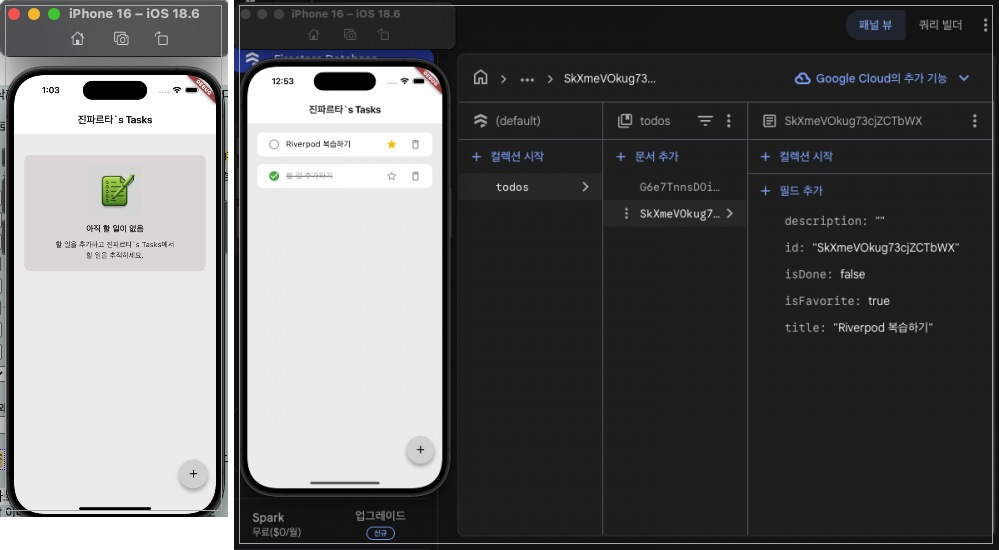

# ToDo App (with Firebase & MVVM)
이 프로젝트는 Flutter 기반으로 한 ToDo 애플리케이션 입니다.
**상태관리(MVVM)** 와 **데이터베이스(Firebase Firestore)** 연동하여 앱을 종료했다가 다시 실행해도 기존에 작성한 ToDo 내용이 유지되도록 구현했습니다.



---

## 1. 프로젝트 소개

### 프로젝트 목표
- 구현 기간: 2026.01.09 ~ 2026.01.15
- 목적 : 효율적인 할 일 관리 및 데이터 실시간 동기화 구현 학습
  - Backend: Firebase (Cloud Firestore, Firebase Core)
  - Riverpod + MVVM 패턴을 적용한 상태 관리
  - 상태 관리 및 아키텍처: MVVM 패턴 기반 구조화

- 앱 개요
  - ToDo 목록 조회
  - ToDo 추가 / 수정
  - 즐겨찾기(Favorite) 설정
  - 완료 여부(Done) 관리
  - Firestore와 실시간 동기화

## 2. 주요 기능 및 흐름 설명

#### 전체 흐름 요약
```dart
UI(View)
  ↓ 사용자 입력
ViewModel (Riverpod Provider)
  ↓ 비즈니스 로직 처리
Repository
  ↓ 데이터 요청
Firebase Firestore
```

#### 개발 단계 (작업 순서)
```dart
Data Model (Entity) 설계
  ↓ 
Repositoty 구현
  ↓ 
ViewModel 구현
  ↓
View 결합 (UI)
```
### Firebase & Firestore 연동
- Firebase 연결
  - firebase_options.dart를 통해 플랫폼별(Android/iOS) 설정을 자동화하고, 앱 시작 시 Firebase를 초기화 했습니다.

- Firestore 데이터베이스
  - todos 컬렉션을 생성하여 사용자의 할 일 데이터를 실시간으로 읽고(Read), 쓰고(Create), 수정(Update)하고, 삭제(Delete)하는 CRUD 기능을 만들었습니다.

### MVVM 패턴 활용
데이터 처리 로직과 UI 레이어를 분리하여 코드의 가독성과 독립성을 높였습니다.
**Model** : `todo_entity.dart`
ToDo 데이터의 구조를 정의하며, Firestore와 통신하기 위한 객체 모델입니다.

**ViewModel** : `home_view_model.dart`
UI에서 필요한 비즈니스 로직을 처리하고, Repository를 통해 데이터를 가져와 상태를 관리합니다.

**View (UI)** : `home_page.dart/bottom_add_todo.dart`
사용자에게 보여지는 화면입니다. ViewModel의 상태를 구독하여 화면을 갱신합니다.

**Repository** : `todo_repository.dart`
데이터 소스(Firestore)에 직접 접근하여 추상화된 데이터 인터페이스를 제공합니다.

## 3. 프로젝트 파일 구조
```dart
lib/
├── data/
│   ├── model/
│   │   └── todo_entity.dart        # 할 일 데이터 클래스 (Entity)
│   └── repository/
│       └── todo_repository.dart    # Firestore 통신 및 데이터 처리 레이어
├── ui/
│   └── home/
│       ├── widgets/
│       │   ├── bottom_add_todo.dart # 할 일 추가 바텀 시트
│       │   ├── no_todo.dart         # 할 일이 없을 때 표시되는 화면
│       │   └── todo_list_view.dart  # 할 일 목록 리스트 뷰
│       ├── home_page.dart           # 메인 홈 화면 UI
│       └── home_view_model.dart     # 홈 화면 상태 관리 및 로직 (ViewModel)
└── firebase_options.dart            # Firebase 설정 자동 생성 파일
``` 
---

프로젝트를 마치며

- 아키텍처와 상태 관리의 중요성
  - 초보 개발자로서 단순히 화면을 그리는 것을 넘어, 왜 MVVM 패턴과 Riverpod이 필요한지 체감할 수 있오서 재미었습니다

  - 처음에는 코드를 한 곳에 몰아넣는 것이 편했지만, 코드가 길어지고, 관리할 파일이 많아질 수록 데이터(Model), 로직(ViewModel), 화면(UI)을 분리하는 것이 유지보수에 얼마나 효율적인지 깨달았습니다!


- 앞으로의 방향성
  - 현재에 안주하지 않고, 앞으로 어떤 기술 Clean Architecture, Unit Test, 애니메이션? 등 아직 사용해보지 않은 기술들을 앱에 도입해서 더 좋은 기능을 가진 앱을 구현해보고싶습니다..!
