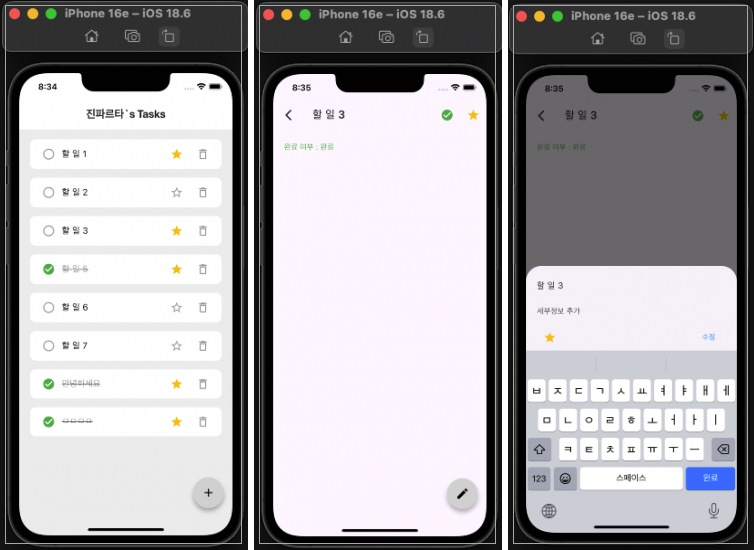
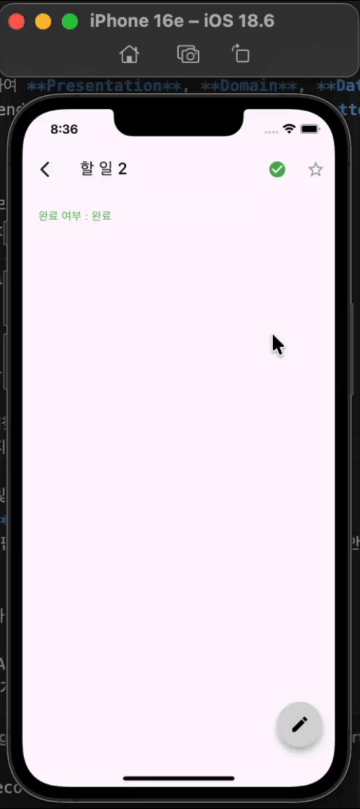

# Firebase Todo App

## 프로그램 소개
기존 MVVM 구조의 Todo App을 **Clean Architecture**로 리팩토링한 프로젝트입니다.   
유지보수성과 확장성을 고려하여 **Presentation**, **Domain**, **Data** 레이어로 분리하고, 의존성 주입(Dependency Injection)과 **Repository Pattern**을 적용하여 결합도를 낮추었습니다.

## 프로젝트 목표
- 목적: 효율적인 할 일 관리 및 데이터 실시간 동기화
   - Firebase Firestore와 연동하여 실시간 데이터 동기화
   - Riverpod을 활용한 효율적인 전역 상태 관리 및 비동기 데이터 처리
   - Clean Architecture를 적용하여 유지보수성과 확장성을 고려한 코드 작성



---

## 주요 기능
- **할 일 목록 관리**
  - 할 일 목록 조회 및 완료 상태 토글
- **항목 추가 및 수정**
  - 제목, 상세 내용, 즐겨찾기 설정 가능
  - 기존 항목 내용 수정 지원
- **즐겨찾기 기능**
  - 중요 항목 별도 표시 및 관리
- **삭제하기 버튼+디바운싱**
 - 삭제하기 버튼을 누르면 팝업으로 '정말 삭제하시겠습니까?' 띄우고, 3초 안에 다시 누르면 삭제 안 되도록 디바운싱 적용
- **Hero Animation**
 - 리스트에서 항목을 클릭하면 디테일 페이지로 이동할 때 부드럽게 이동
- **나만의 기능 추가**
  - detail page에서 FAB 수정하기 기능 추가
  - detail page에서 즐겨찾기, 완료하기 기능 추가
- **상태 관리**
  - Riverpod을 활용한 효율적인 전역 상태 관리 및 비동기 데이터 처리
  


## 개발 단계 (작업 순서)
### 클린 아키텍처 구조로 리펙토링
1. 파일 나누기
data / domain / presentation 파일 나누고 파일 이동
2. dto 파일과 entity 파일 분리
3. Mapper 구현
DTO -> Entity
Entity -> DTO
4. Repository 구현
domain Layer (인터페이스 구현)
5. 실구현체 만들기
기존의 todoRepository 구현체를 data Layer에 이동
6. UseCase 구현
Domain Layer (인터페이스 구현)
7. Provider 구현
Presentation Layer (Use case 주입)
8. HomeViewModel 구현
Presentation Layer 

## Test 
- Widget test
  - widget test를 통해 데이터가 없을 때와 있을 때 TodoListView 위젯이 화면을 잘 그리는지 테스트 

---


## 개발 기간
- **2026.01.30 ~ 2026.02.03** (5일간)

## 기술 스택
- **Framework & Language**
  - [Flutter](https://flutter.dev) (SDK 3.10.4+)
  - [Dart](https://dart.dev)
- **State Management**
  - [flutter_riverpod](https://pub.dev/packages/flutter_riverpod) (^3.1.0)
- **Backend (Firebase)**
  - [firebase_core](https://pub.dev/packages/firebase_core)
  - [cloud_firestore](https://pub.dev/packages/cloud_firestore)
- **Navigation**
  - [go_router](https://pub.dev/packages/go_router)
- **Architecture**
  - Clean Architecture (MVVM + Repository Pattern)

## 프로젝트 파일 구조
```
lib
├── core          # 프로젝트 전반에 사용되는 공통 유틸리티 및 Provider
├── data          # 데이터 계층 (외부 데이터 소스와의 통신 담당)
│   ├── data_source # Firebase 등 원격/로컬 데이터 소스
│   ├── dto         # Data Transfer Object (API 응답 모델)
│   ├── mapper      # DTO <-> Entity 변환 로직
│   ├── model       # 데이터 모델
│   └── repository  # Repository 구현체 (Impl)
├── domain        # 비즈니스 로직 계층 (순수 Dart 코드)
│   ├── entity      # 핵심 비즈니스 객체
│   ├── repository  # Repository 인터페이스 (추상화)
│   └── use_case    # 비즈니스 로직 단위 (Use Cases)
├── presentation  # UI 계층 (화면 및 상태 관리)
│   └── home        # 홈 화면 관련 (UI, ViewModel, Widgets)
├── firebase_options.dart
└── main.dart
```
